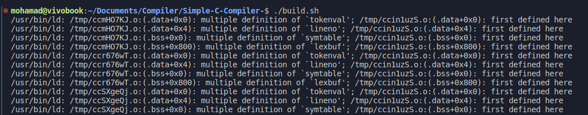

# Simple-C-Compiler- <sub>[Book Reference](https://drive.google.com/file/d/10LVcCT-P3RbUJ_kDUBDSiyavalrJRx82/view?usp=sharing)</sub>

### Here is [instructions for creating a simple compiler in C](https://drive.google.com/file/d/1MqXruiM849l0Eix4f5jot6pyy-fcVgOs/view?usp=sharing)

split into modules like lexer, parser, emitter, symbol, init, error, and main. It explains how to compile and execute the compiler under UNIX.

---

### Global Header File (global.h)

The `global.h` header file contains essential declarations, constants, and function prototypes used throughout the compiler implementation. It includes standard library headers, defines token values, buffer sizes, and structures for symbol table entries. Additionally, it declares functions for lexical analysis, parsing, error handling, and symbol table management.

---

### To compile the seven files (lexer.c, parser.c, emitter.c, symbol.c, init.c, error.c, main.c) in VS Code on Ubuntu OS

1. Create a Header File: If you haven't already, create a `global.h` header file.

2. Install the `build-essential` package.

#### Method 1:

3. Create a `tasks.json` file in the `.vscode` directory within your project directory. You can use this file to define build tasks.

4. Define a build task that compiles all the source files using the `cc` command. Here's an example `tasks.json` configuration:

```
{
    "version": "2.0.0",
    "tasks": [
        {
            "label": "build-compiler",
            "type": "shell",
            "command": "cc",
            "args": ["-o", "compiler", "lexer.c", "parser.c", "emitter.c", "symbol.c", "init.c", "error.c", "main.c"],
            "group": {
                "kind": "build",
                "isDefault": true
            },
            "problemMatcher": {
                "owner": "cpp",
                "fileLocation": ["relative", "${workspaceFolder}"],
                "pattern": {
                    "regexp": "^(.*):(\\d+):(\\d+):\\s+(warning|error):\\s+(.*)$",
                    "file": 1,
                    "line": 2,
                    "column": 3,
                    "severity": 4,
                    "message": 5
                }
            }
        }
    ]
}

```

5. Build the Compiler:

   - Press `Ctrl + Shift + B` to open the Command Palette in VS Code.
   - Select the `build-compiler` task to compile the files and create the executable `compiler` output file.

6. Run the Compiler:

   - After a successful build, you can run the compiler by executing `./compiler` in the terminal within your project directory.
   - Follow the instructions provided in the original document to exercise the compiler with expressions.

#### OR Method 2:

3. Create a Build Script: Since you have multiple files, it's best to create a build script to compile them together. Create a file named `build.sh` in your folder.And
   make sure to grant execute permission to this script by running `chmod +x build.sh` in the terminal.

4. Run the build script by typing `./build.sh` and pressing Enter.

---

## Notes:

- In C programming, the `extern` keyword is used to declare a variable that is defined elsewhere in the program or in another file. This is commonly used in situations where multiple source files need to access the same variable. By using `extern` in a header file, for example, you can declare a variable that is defined in one of the source files that includes the header. It's worth noting that when you use `extern`, you're only declaring the variable; you're not allocating storage for it. The actual storage is allocated when the variable is defined elsewhere.


---

## Bugs:

- resolves compiling [multiple definition of files error](https://chat.openai.com/share/71c043ad-5a15-4496-b7a7-6a31706ba596):

  

- [Segmentation fault (core dumped)](https://stackoverflow.com/questions/73928569/compiler-keeps-giving-signal-segmentation-fault-core-dumped-error) occurs in my `symbol.c` `strcpy()`:

```
int insert(char *s, int tok) {
    int len = strlen(s);
    if (len + 1 >= BSIZE)
        error("lexemes array full");

    -->strcpy(symtable[len].lexptr, s);
    symtable[len].token = tok;
    return len;
}
```

To fix this issue, you need to allocate memory for `lexptr` before copying the string `s` into it. Here's how you can modify the insert function:

```
// Include stdlib.h for memory allocation functions

int insert(char *s, int tok) {
    int len = strlen(s);
    if (len + 1 >= BSIZE)
        error("lexemes array full");

    symtable[lastentry].lexptr = malloc(len + 1); // Allocate memory for lexptr
    if (symtable[lastentry].lexptr == NULL) {
        error("memory allocation failed"); // Handle allocation failure
    }

    strcpy(symtable[lastentry].lexptr, s); // Copy the string into lexptr
    symtable[lastentry].token = tok;
    return lastentry;
}
```

and Don't forget to free the allocated memory when it's no longer needed, typically when you're done with the symbol table. This is why we create `freeSymbolTable()` ,declared its variable `lastentry` and call the function inside `main()`
